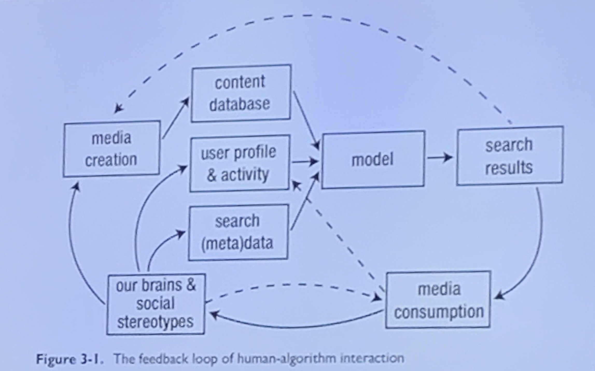
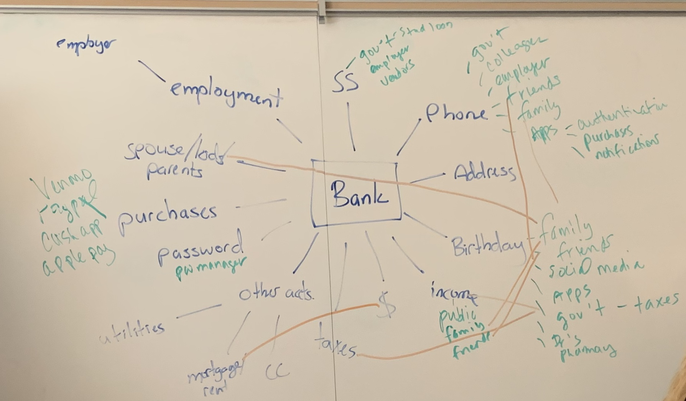
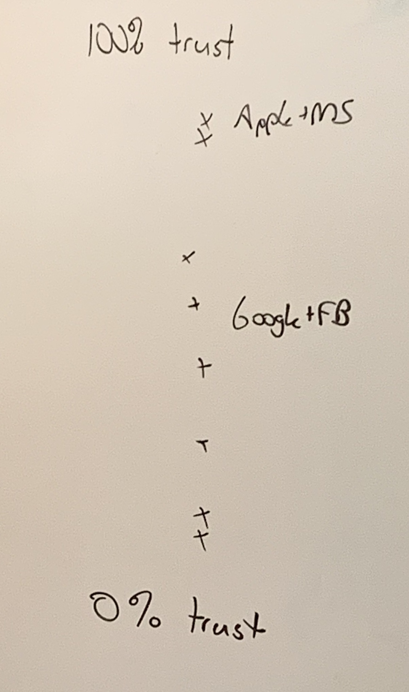

# Notes

[website for track - dpl.pushpullfork.com](https://dpl.pushpullfork.com)

[R for Data Science book](https://r4ds.had.co.nz/)

## Day 1

[cool intro activity](https://github.com/kschaffer/dplintros)

### Representation

[domains modules, we specifically used the representation one](https://umw.domains/modules)

Input + Content --> Algo (black box) --> Output

What is the output? 

Representation:
 - Unconscious bias
   - developers
   - users
   - other users

Older conceptions <--> Stereotypes

**Engagement is easy to count and measure. So it is often used to measure the success of the algorithm.** 

[Who does Google think I am?](https://adssettings.google.com/authenticated) - Might be interesting activity for digciz tutorial

Without a check in the code, the algorithm's version of reality will radicalize beyond the hard-coded reality and the stereotype because of the loop.

If you click things that you feel are more just you can positively impact this loop.

Checks in the code could be what text is extracted around the image to improve results.

#### How do we hack/influence the model?
  - media creation
  - open content
  - reporting on the platform (sorta works, but moderators lack context)
  - Activism - public pressure, legislative pressure
  - educate 
  - deliberate consumption
  - self-examination

## Day 2

[Kumu](https://kumu.io) for mapping

Mapping activity about data, what does your  bank know about you? (ex: Phone, Income, SSN) and what other companies know this stuff

DatDA
  - legal action (if you have the resources)
  - legislative pressure
  - educate
  - gather info (Terms of Service, Privacy policies), use something like [Diffchecker](https://www.diffchecker.com/)
  - OS
  - browser
  - public pressure
    - on lawmakers
    - on companies
  - data cleanups
  - pw managers
  - diff emails, or + email addresses (myemail@gmail.com myemail+bestbuy@gmail.com), or adding periods in gmail addresses
  - separation of accounts or maybe devices
  - VPN or TOR, use a reputable VPN service that costs money
  - deleting apps

Trust Compression (from [@holden](https://twitter.com/holden))

We tend to lump together the 50% trustworthy things with things near the bottom of the scale

DigDetox
 - how many apps on your phone? 166
 - how many have you used in the last 7 days? 73 44%
 - how many apps do you know how they use your data? 
 
Privacy vs. Secret
 - root of privacy is privy, who do you tell things?

# importing data
`name <- read_csv('somefile.csv')`
use `read_csv` for the tidyverse way of doing things, gets us tibbles instead of tables

`colnames(name)` gives you just the column names of data you have imported

[web scraping package to check out at some point](https://blog.rstudio.com/2014/11/24/rvest-easy-web-scraping-with-r/)

## Wednesday

### Ed-tech algorithms and critiquing big-data marking hype

[presentation link](https://kshaffer.github.io/edtechalgorithms)

Data Science is Data Science
  - when edtech companies talk about proprietary stuff they are really talking about a creative arrangement of stuff that the data science world is already using

More data beats a better algorithm
  - a fundamental problem in data science, sometimes we start with very little data
  - more real data beats a creative algorithm
  
Machine learning
  - applied statistics
  - algorithmic analysis to make better predictions
  
|                | Classification | Regression |
| -------------- | -------------- | ---------- |
| Supervised     |                |            |
| Unsupervised   |                |            |

Categorical vs. Continuous
  - continuous data has a scale
    - weight, height
  - categorical can't be measured on a scale
    - hair color, what team does someone play on 
    
Classification vs Regression algorithms
  - Classification is an algorithm most often used for categorical
  - Regression algorithms give use continuous data
  
Supervised vs Unsupervised
  - supervised learning = both data and outcomes are known, the algorithms are just for relationships
    - you have some data where you known the outcome, and some where you don't so you use the known outcomes to train the model to predict the outcomes
    - supervised is more common, its also easier to demonstrate it was successful
  - unsupervised learning = we know the data, but outcomes and relationships are emergent
    - harder to do, harder to know you got it right especially at first
    
Correlation = two parameters of data for the same observations, do they go together?
  - ex: Is there a relationship between number of dogs owned and annual vacuum filter purchases?

[CrossValidated is great for statistics questions](https://stacks.stackexchange.com)

Chi-Squared Test = comparing two stgreams of categorical data
  - ex: is there a relationship between house architecture and selling price?
  
Anova (Analysis of Variance) = comparing a stream of categorical data with a stream of continous data
  - ex: is there a relatinoship between house architecture and selling price?

#### Supervised Regression Algorithms
*Note: check the presentation for helpful images*

Linear regression = what is the relationship between contibuting facgtor(s) and a continous data result?
  - what is the impact of home size and age on sale price?

Logistic regression = what is the relationship between contributing factors and a categorical result?
  - do calorie intake and fat intake contribue to heart attacks?
  
#### Supervised classification algorithms
How do specific features influence classification? How can that information be used to classify new observations?
  - Ex.: Voice recognition, OCR, face detection.

K-Nearest Neighbor
  - computationally cheap

Decision Tree

Random Forest

Neural Networks
  - when you hear about a black box that even data scientists don't know what is going on, this is probably what they are talking about, DS's know how it works, but its something a human couldn't do with a pencil paper and calculator and an unlimited amount of time

#### Unsupervised classification algorithms
Given a known set of features, what kinds of classifications emerge from the data?
  - ex: recommendation systems
  
Topic Modeling

Cluster Analysis

#### Sequential Models
Given an event or sequence of events, what is the likelihood that a particular event will happen next?

Markov Models

#### Exploration of [Knewton Adaptive Learning](https://cdn.tc-library.org/Edlab/Knewton-adaptive-learning-white-paper-1.pdf)

  - is it classificatino or regression?
    - mostly classification, which means its putting students into categories across all students in the system, so the personalization of the learning might actually be less personalized if you wrote questions for a class of 32 students
  - is it supervised or unsupervised?
  - what are the data sources/features?
  - what are the predicted ouputs?
  - what is the pedagogical intention?
